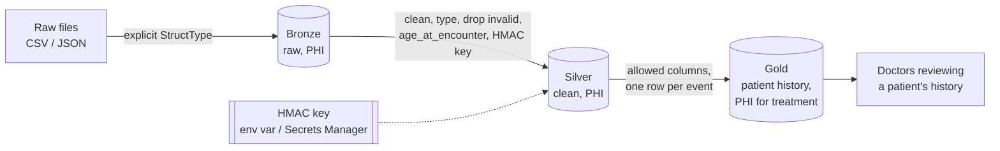
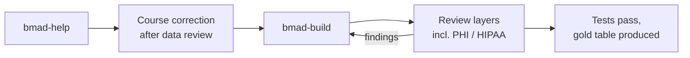

# Architecture diagrams

## Data flow

```mermaid
flowchart LR
  raw[Raw files<br/>CSV / JSON] -->|explicit StructType| bronze[(Bronze<br/>raw, PHI)]
  bronze -->|clean, type, drop invalid,<br/>age_at_encounter, HMAC key| silver[(Silver<br/>clean, PHI)]
  silver -->|allowed columns,<br/>one row per event| gold[(Gold<br/>patient history,<br/>PHI for treatment)]
  key[[HMAC key<br/>env var / Secrets Manager]] -.-> silver
  gold --> doctors[Doctors reviewing<br/>a patient's history]
```

## Development flow

```mermaid
flowchart LR
  help[bmad-help] --> correct[Course correction<br/>after data review]
  correct --> build[bmad-build]
  build --> review[Review layers<br/>incl. PHI / HIPAA]
  review -->|findings| build
  review --> done[Tests pass,<br/>gold table produced]
```
